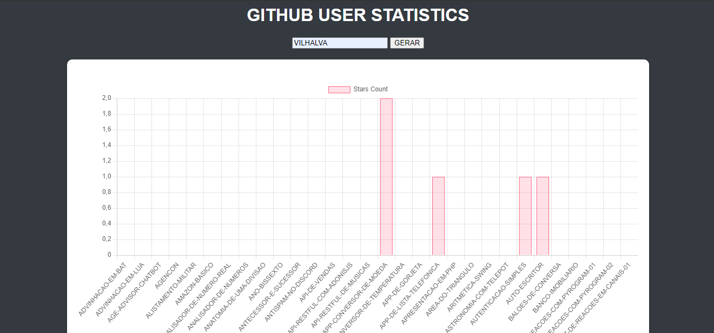
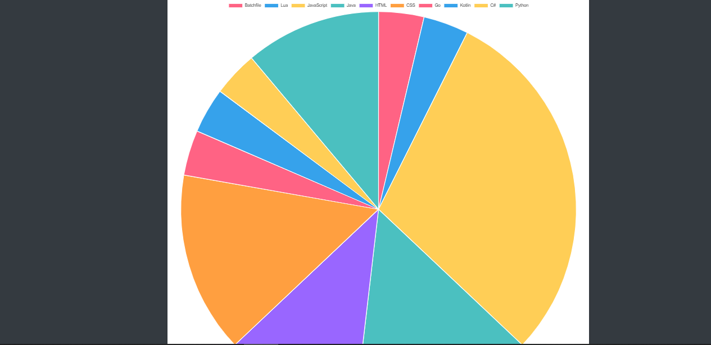
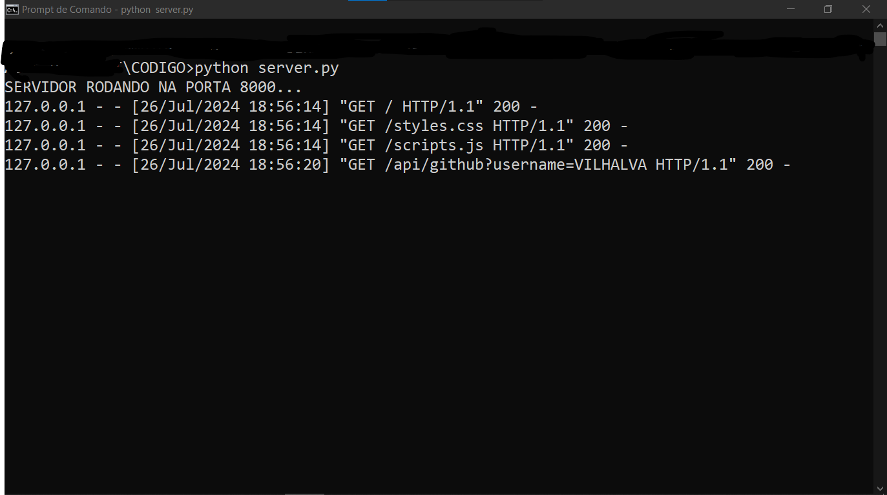

# GITHUB USER STATISTICS
👨‍🏫VEJA AS ESTATISTICAS DOS REPOSITÓRIOS DOS USUÁRIOS VIA CHARTJS E PANDAS COM O USO DA API DO GITHUB.

 <br>
 <br>
 <br>

## DESCRIÇÃO
Este projeto é uma aplicação web que permite visualizar estatísticas de repositórios de um usuário do GitHub. O projeto inclui:

- **Servidor Python**: Um servidor HTTP que faz a requisição para a API do GitHub e fornece os dados em formato JSON.
- **Interface Web**: Uma página HTML com um formulário para inserir o nome de usuário do GitHub e gráficos para visualizar as estatísticas dos repositórios do usuário.

## COMPONENTES:
1. **Servidor Python (`server.py`)**:
   - **Função**: Serve como backend para buscar e fornecer dados dos repositórios do GitHub com base no nome de usuário fornecido.
   - **Endpoint**: `/api/github?username=USERNAME`, onde `USERNAME` é o nome de usuário do GitHub inserido no formulário.
   - **Dependências**: `pandas` (para manipulação de dados), `json` e `urllib` (para requisições HTTP e manipulação de URLs).

2. **Página HTML (`index.html`)**:
   - **Formulário**: Permite ao usuário inserir o nome de usuário do GitHub.
   - **Gráficos**: Exibe estatísticas dos repositórios do usuário em gráficos de barras e pizza, usando a biblioteca Chart.js.
   - **Dependências**: `Chart.js` (para criação dos gráficos), CSS para estilização.

## EXECUTANDO O PROJETO:
1. **Instalando as dependências:**
   - Antes de executar o site, certifique-se de instalar todas as dependências necessárias. No terminal, execute o seguinte comando para instalar as dependências listadas no arquivo `requirements.txt` em `CODIGO`:
   ```bash
   pip install -r requirements.txt
   ```

2. **Inicie o Servidor Web Local**
   - Ainda no diretório `./CODIGO`,  e execute o seguinte comando no terminal:

   ```bash
   python server.py
   ```

   - Isso iniciará um servidor web local na porta 8000 por padrão.

3. **Acesse a Página**
   - Abra um navegador web e acesse a seguinte URL: [http://localhost:8000](http://localhost:8000).

4. **Uso da Aplicação**
   - **No formulário da página web**, insira o nome de usuário do GitHub e clique no botão "Fetch Data".
   - **Os gráficos serão atualizados** com as estatísticas dos repositórios do usuário:
     - **Gráfico de Barras**: Mostra a contagem de estrelas para cada repositório.
     - **Gráfico de Pizza**: Mostra a distribuição dos repositórios por linguagem de programação.

## NÃO SABE?
- Entendemos que para manipular arquivos em `HTML`, `CSS` e outras linguagens relacionadas, é necessário possuir conhecimento nessas áreas. Para auxiliar nesse aprendizado, oferecemos cursos gratuitos disponíveis:
* [CURSO DE HTML E CSS](https://github.com/VILHALVA/CURSO-DE-HTML-E-CSS)
* [CURSO DE PYTHON](https://github.com/VILHALVA/CURSO-DE-PYTHON)
* [CURSO DE JAVASCRIPT](https://github.com/VILHALVA/CURSO-DE-JAVASCRIPT)
* [CURSO DE CHARTJS](https://github.com/VILHALVA/CURSO-DE-CHARTJS)
* [CURSO DE PANDAS](https://github.com/VILHALVA/CURSO-DE-PANDAS)
* [CONFIRA MAIS CURSOS](https://github.com/VILHALVA?tab=repositories&q=+topic:CURSO)

## CREDITOS:
- [PROJETO BASEADO NO "ESTATISTICAS DO GITHUB"](https://github.com/VILHALVA/ESTATISTICAS-DO-GITHUB)
- [PROJETO FEITO PELO VILHALVA](https://github.com/VILHALVA)
